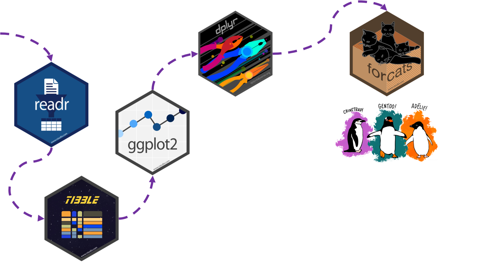

class: penguin-tour

```{r, echo=FALSE, out.width=1200}

```

.footnote[<span>Photo by <a href="https://unsplash.com/@eadesstudio?utm_source=unsplash&amp;utm_medium=referral&amp;utm_content=creditCopyText">James Eades</a> on <a href="https://unsplash.com/collections/12240655/palmerpenguins/d5aed8c855e26061e5e651d3f180b76d?utm_source=unsplash&amp;utm_medium=referral&amp;utm_content=creditCopyText">Unsplash</a></span>
]

---
background-image: url(images/hex/forcats.png)
background-position: 1050px 50px
background-size: 80px
  
# forcats: info

.panelset[

.panel[.panel-name[Overview]
### Helps us work with **categorical variables** or factors. 

### These are variables that have a fixed and known set of possible values, like `species`, `island`, and `sex` in our `penguins` dataset.
]

.panel[.panel-name[Cheatsheet]

`r icon::fa("file-pdf")` PDF: https://github.com/rstudio/cheatsheets/raw/master/factors.pdf

]

.panel[.panel-name[Reading]

.left-column[
```{r echo=FALSE}
knitr::include_graphics("images/r4ds-cover.png")
```
]

.right-column[
### R for Data Science: [Ch 15 Factors](https://r4ds.had.co.nz/factors.html)

### Package documentation: https://forcats.tidyverse.org/
]
]
]

---
background-image: url(images/hex/forcats.png)
background-position: 1050px 50px
background-size: 80px

# forcats: exercise

.panelset[
.panel[.panel-name[Code]
.pull-left[
### Currently the `year` variable in `penguins` is continuous from 2007 to 2009.

### There may be situations where this isn't what we want and we might want to turn it into a categorical variable instead.
]

.pull-right[

### The `factor()` function is perfect for this.
```{r eval=FALSE}
penguins %>%
  mutate(year_factor = 
           factor(year,                   #<<
                  levels = unique(year))) #<<
```
]


]

.panel[.panel-name[Result]
### The result is a new factor `year_factor` with levels `2007`, `2008` and `2009`
.pull-left[
```{r}
penguins_new <-
  penguins %>%
  mutate(year_factor = 
           factor(year,                   #<<
                  levels = unique(year))) #<<
penguins_new
```
]

.pull-right[
```{r}
class(penguins_new$year_factor)

levels(penguins_new$year_factor)
```
]
]
]
