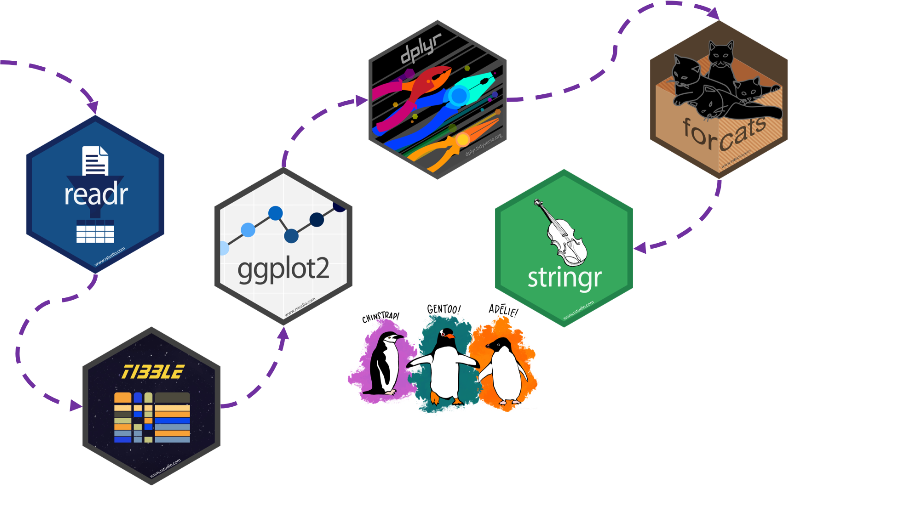

class: penguin-tour

```{r, echo=FALSE, out.width=1200}

```

.footnote[<span>Photo by <a href="https://unsplash.com/@eadesstudio?utm_source=unsplash&amp;utm_medium=referral&amp;utm_content=creditCopyText">James Eades</a> on <a href="https://unsplash.com/collections/12240655/palmerpenguins/d5aed8c855e26061e5e651d3f180b76d?utm_source=unsplash&amp;utm_medium=referral&amp;utm_content=creditCopyText">Unsplash</a></span>
]

---
background-image: url(images/hex/stringr.png)
background-position: 1050px 50px
background-size: 80px
  
# stringr: info

.panelset[

.panel[.panel-name[Overview]

.pull-left[
### `stringr` helps us manipulate strings! The package includes many functions to help us with **regular expressions**, which are a concise language for describing patterns in strings.
]

.pull-right[
### These functions help us

-  detect matches
-  subset strings
-  manage string lengths
-  mutate strings
-  join and split strings
-  order strings
-  ...and more!
]

]

.panel[.panel-name[Cheatsheet]

`r icon::fa("file-pdf")` PDF: https://github.com/rstudio/cheatsheets/raw/master/strings.pdf

]

.panel[.panel-name[Reading]

.left-column[
```{r echo=FALSE}
knitr::include_graphics("images/r4ds-cover.png")
```
]

.right-column[
### R for Data Science: [Ch 14 Strings](https://r4ds.had.co.nz/strings.html)

### Package documentation: https://stringr.tidyverse.org/
]
]
]

---
background-image: url(images/hex/stringr.png)
background-position: 1050px 50px
background-size: 80px

# stringr: exercise

.panelset[
.panel[.panel-name[Mutate]

### What does this chunk do?
```{r}
penguins %>%
  select(species, island) %>%
  mutate(ISLAND = str_to_upper(island)) #<<
```
]

.panel[.panel-name[Join]

### How about this one?
```{r}
penguins %>%
  select(species, island) %>%
  mutate(ISLAND = str_to_upper(island)) %>%
  mutate(species_island = str_c(species, ISLAND, sep = "_")) #<<
```
]
]
