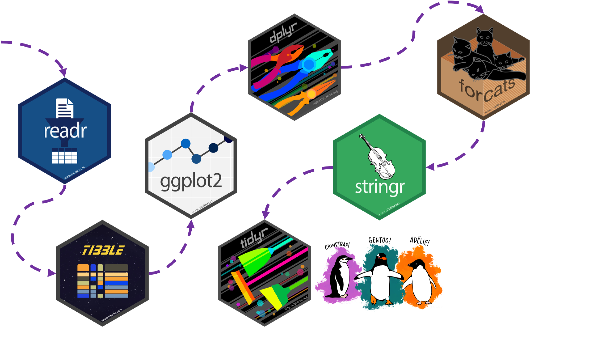

class: penguin-tour

```{r, echo=FALSE, out.width=1200}

```

.footnote[<span>Photo by <a href="https://unsplash.com/@eadesstudio?utm_source=unsplash&amp;utm_medium=referral&amp;utm_content=creditCopyText">James Eades</a> on <a href="https://unsplash.com/collections/12240655/palmerpenguins/d5aed8c855e26061e5e651d3f180b76d?utm_source=unsplash&amp;utm_medium=referral&amp;utm_content=creditCopyText">Unsplash</a></span>
]

---
background-image: url(images/hex/tidyr.png)
background-position: 1050px 50px
background-size: 80px
  
# tidyr: info

.panelset[

.panel[.panel-name[Overview]
[From R for Data Science](https://r4ds.had.co.nz/tidy-data.html):

> There are three interrelated rules which make a dataset tidy:

> - Each variable must have its own column.
> - Each observation must have its own row.
> - Each value must have its own cell.


]

.panel[.panel-name[Cheatsheet]

`r icon::fa("file-pdf")` PDF: https://github.com/rstudio/cheatsheets/raw/master/data-import.pdf

]

.panel[.panel-name[Reading]

.left-column[
```{r echo=FALSE}
knitr::include_graphics("images/r4ds-cover.png")
```
]

.right-column[
### R for Data Science: [Ch 12 Tidy data](https://r4ds.had.co.nz/tidy-data.html)

### Package documentation: https://tidyr.tidyverse.org/
]
]
]

---
background-image: url(images/hex/tidyr.png)
background-position: 1050px 50px
background-size: 80px

# tidyr: exercise

.panelset[
.panel[.panel-name[Un-tidying]

### Both penguin datasets are already tidy!

We can pretend that the `penguins` dataset wasn't tidy and that it looked instead like `untidy_penguins` below. 

In `untidy_penguins`, `body_mass_g` was recorded separately for `male`, `female`, and sex `NA` penguins.

```{r}
untidy_penguins <-
  penguins %>%
    pivot_wider(names_from = sex,
                values_from = body_mass_g)
untidy_penguins
```

]

.panel[.panel-name[Re-tidying]

### Now let's make it tidy again!

#### We'll use the help of `pivot_longer()`

```{r}
untidy_penguins %>%
  pivot_longer(cols = male:`NA`,           #<<
               names_to = "sex",           #<<
               values_to = "body_mass_g")  #<<
```
]
]