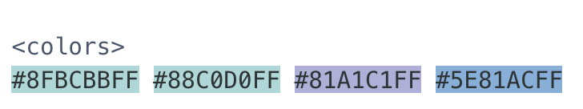

class: penguin-tour

```{r, echo=FALSE, out.width=1200}
knitr::include_graphics("images/pptx/08-purrr.png")
```

.footnote[<span>Photo by <a href="https://unsplash.com/@eadesstudio?utm_source=unsplash&amp;utm_medium=referral&amp;utm_content=creditCopyText">James Eades</a> on <a href="https://unsplash.com/collections/12240655/palmerpenguins/d5aed8c855e26061e5e651d3f180b76d?utm_source=unsplash&amp;utm_medium=referral&amp;utm_content=creditCopyText">Unsplash</a></span>
]

---
background-image: url(images/hex/purrr.png)
background-position: 1050px 50px
background-size: 80px
  
# purrr: info

.panelset[

.panel[.panel-name[Overview]
.pull-left[
### Provides tools for working with functions and vectors 

### The `purrr` family of functions helps us replace for loops, making our code easier to read and more succint.
]

.pull-right[
### With `purrr` you can

- Iterate over a single input with `map()`
- Iterate over two inputs in parallel with `map2()`
- Iterate with multiple arguments with `pmap()`
- Iterate with multiple arguments and functions with `invoke_map()`
- Call a function for its side-effects with `walk()`, `walk2()`, and `pwalk()`
]
]

.panel[.panel-name[Cheatsheet]

`r icon::fa("file-pdf")` PDF: https://github.com/rstudio/cheatsheets/raw/master/purrr.pdf

]

.panel[.panel-name[Reading]

.left-column[
```{r echo=FALSE}
knitr::include_graphics("images/r4ds-cover.png")
```
]

.right-column[
### R for Data Science: [Ch 21 Iteration](https://r4ds.had.co.nz/iteration.html)

### Package documentation: https://purrr.tidyverse.org/
]
]
]

---
background-image: url(images/hex/purrr.png)
background-position: 1050px 50px
background-size: 80px

# purrr: exercise

.panelset[
.panel[.panel-name[Time for a change?]

.pull-left[
### Ok, we love our earlier boxplot showing us **body_mass_g** by **sex** and colored by **species**... but let's change up the colors to keep with our Antarctica theme!

### I'm a big fan of the color palettes in the `nord` `r emo::ji("package")`
]
.pull-right[

]
]

.panel[.panel-name[Goal]

.pull-left[
### Let's turn this plot
```{r echo=FALSE, warning=FALSE, fig.height=5}
penguins %>%
  ggplot(aes(x = sex, y = body_mass_g)) +
  geom_boxplot(aes(fill = species))
```
]

.pull-right[
### Into this one!
```{r echo=FALSE, warning=FALSE, fig.height=5}
penguins %>%
  ggplot(aes(x = sex, y = body_mass_g)) +
  geom_boxplot(aes(fill = species)) +
  scale_fill_manual(values = nord::nord_palettes$frost)
```

.panel[.panel-name[Option 1]

.pull-left[
```{r}
library(nord)

# you can choose colors using 
# the color hex codes
nord::nord_palettes$frost
```

```{r eval=FALSE}
# and assign them using the 
# `scale_fill_manual()` function
penguins %>%
  ggplot(aes(x = sex, y = body_mass_g)) +
  geom_boxplot(aes(fill = species)) +
  scale_fill_manual(values = c("#8FBCBB", "#88C0D0", "#81A1C1")) #<<
```
]

.pull-right[
```{r echo=FALSE, fig.height=5}
# and assign them using the `scale_fill_manual()` function
penguins %>%
  ggplot(aes(x = sex, y = body_mass_g)) +
  geom_boxplot(aes(fill = species)) +
  scale_fill_manual(values = c("#8FBCBB", "#88C0D0", "#81A1C1"))
```
]
]


.panel[.panel-name[Options 2 & 3]

.pull-left[
...but you might prefer to use the palette name! <br/>
```{r eval=TRUE, warning=FALSE, fig.height=3, fig.width=5}
penguins %>%
  ggplot(aes(x = sex, y = body_mass_g)) +
  geom_boxplot(aes(fill = species)) +
  scale_fill_manual(values = nord::nord_palettes$frost) #<<
```
]

.pull-right[
And some color palette packages also come with their own functions like `scale_fill_nord()`
```{r eval=TRUE, warning=FALSE, fig.height=3, fig.width=5}
penguins %>%
  ggplot(aes(x = sex, y = body_mass_g)) +
  geom_boxplot(aes(fill = species)) +
  nord::scale_fill_nord(palette = "frost") #<<
```
]
]

.panel[.panel-name[Purrr?]

.pull-left[
The `prismatic` `r emo::ji("package")` helps us **see** the colors that correspond to each color hex code (mostly), with the `color()` function

```{r}
library(prismatic)
```

```{r, warning=FALSE, eval=FALSE}
prismatic::color(nord::nord_palettes$frost)
```

]

.pull-right[
`purrr`'s `map()` function can help us iterate `color()` over all palettes in a palette package like `nord`!

```{r, eval = FALSE}
nord::nord_palettes %>% map(prismatic::color)
```


]
]
]
]

.panel[.panel-name[More palettes!]

.pull-left[
### `r emo::ji("art")` [r-color-palettes repo](https://github.com/EmilHvitfeldt/r-color-palettes) from Emil Hvitfeldt

### Like this Wes Anderson themed one! And many, many others. `r emo::ji("star_struck")`
]

.pull-right[

]
]

]