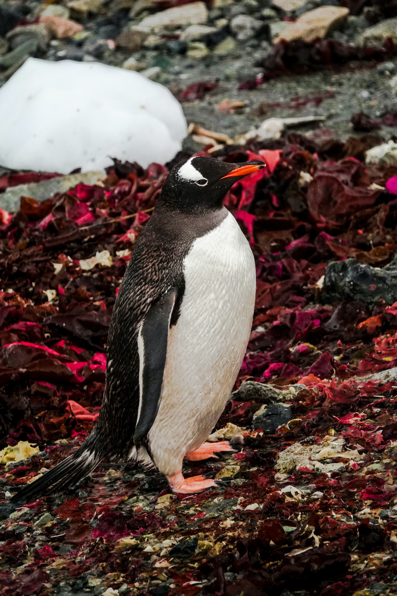
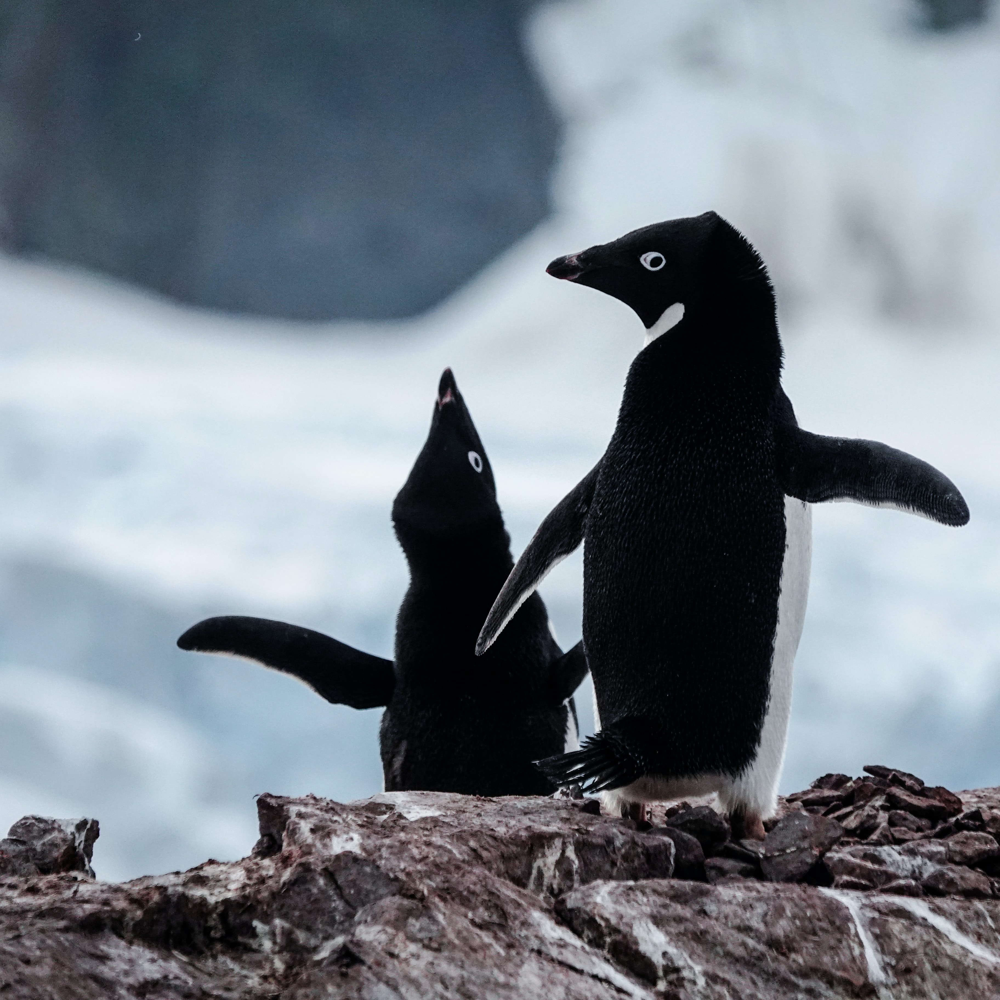

```{r setup, include=FALSE}
options(htmltools.dir.version = FALSE)
knitr::opts_chunk$set(collapse = TRUE,
                      fig.retina = 3,
                      warning = FALSE,
                      message = FALSE)

library(tidyverse)
library(palmerpenguins)
library(nord)
library(prismatic)
library(xaringanExtra)
xaringanExtra::use_xaringan_extra(include = c("panelset", "tile_view", "share_again"))
xaringanExtra::style_share_again(share_buttons = c("twitter", "linkedin", "pocket"))
xaringanExtra::embed_xaringan(
  url = "https://spcanelon.github.io/2020-rladies-chi-tidyverse", ratio = "16:9")
```


class: title-slide, center, bottom

```{r title-slide, echo=FALSE, out.width=400}
knitr::include_graphics("images/lter_penguins.png")
```
# `r rmarkdown::metadata$title`

## `r rmarkdown::metadata$subtitle`

### `r rmarkdown::metadata$author`

<<<<<<< HEAD
<<<<<<< HEAD
### `r rmarkdown::metadata$date`
=======
### August 31, 2020
>>>>>>> update slides
=======
### `r rmarkdown::metadata$date`
>>>>>>> Logo positions and xaringanExtras

---
class: about-me, middle, center

## Silvia Canelón 

### Postdoctoral Research Scientist

### University of Pennsylvania, Philadelphia, PA, USA


[`r icon::fa("link")` silvia.rbind.io](https://silvia.rbind.io)<br/>
[`r icon::fa("twitter")` @spcanelon](https://twitter.com/spcanelon)<br/>
[`r icon::fa("github")` @spcanelon](https://github.com/spcanelon)  

.footnote[<span>Photo by <a href="https://unsplash.com/@lukehuff?utm_source=unsplash&amp;utm_medium=referral&amp;utm_content=creditCopyText">lucas huffman</a> on <a href="https://unsplash.com/s/photos/antarctica?utm_source=unsplash&amp;utm_medium=referral&amp;utm_content=creditCopyText">Unsplash</a></span>]

---
class: left, middle

# Acknowledgments

### [palmerpenguins](https://allisonhorst.github.io/palmerpenguins/articles/intro.html) `r emo::ji("package")` developed by Drs. [Allison Horst](https://www.allisonhorst.com/), [Alison Hill](https://alison.rbind.io/), and [Kristen Gorman](https://www.uaf.edu/cfos/people/faculty/detail/kristen-gorman.php).

### Penguin artwork by Allison Horst ([@allison_horst](https://twitter.com/allison_horst))

### Slide inspiration from Alison Hill ([@apreshill](https://twitter.com/apreshill))'s recent education training materials "[Teaching in Production](https://rstudio-education.github.io/teaching-in-production/)"

<<<<<<< HEAD
<<<<<<< HEAD
### Slides made using Dr. Yihui Xie's [xaringan](https://github.com/yihui/xaringan) `r emo::ji("package")` and Garrick Aden-Buie's [xaringanExtra](https://github.com/gadenbuie/xaringanExtra) `r emo::ji("package")`, and adapted from the [R-Ladies `xaringan` theme designed by Alison Hill](https://alison.rbind.io/post/2017-12-18-r-ladies-presentation-ninja/)
=======
### Slides made using Yihui Xie's [xaringan](https://github.com/yihui/xaringan) `r emo::ji("package")` and Garrick Aden-Buie's [xaringanExtra](https://github.com/gadenbuie/xaringanExtra) `r emo::ji("package")`, and adapted from the [R-Ladies `xaringan` theme designed by Alison Hill](https://alison.rbind.io/post/2017-12-18-r-ladies-presentation-ninja/)
>>>>>>> update slides
=======
### Slides made using Dr. Yihui Xie's [xaringan](https://github.com/yihui/xaringan) `r emo::ji("package")` and Garrick Aden-Buie's [xaringanExtra](https://github.com/gadenbuie/xaringanExtra) `r emo::ji("package")`, and adapted from the [R-Ladies `xaringan` theme designed by Alison Hill](https://alison.rbind.io/post/2017-12-18-r-ladies-presentation-ninja/)
>>>>>>> Fix for consistent logo positions

### Photographs from various photographers on Unsplash, and noted on the relevant slide

---
class: left, top
background-image: url(images/logo.png)
<<<<<<< HEAD
<<<<<<< HEAD
background-position: 1050px 50px
=======
background-position: 92% 10%
>>>>>>> update slides
=======
background-position: 1050px 50px
>>>>>>> Fix for consistent logo positions
background-size: 80px

# Meet our penguin friends!

<div class="flex" style="margin: 0 0em;">
  <div class="column">
    <h3> Chinstrap </h3>
    
  </div>
  
  <div class="column" style="margin: 0 1em;">
    <h3> Gentoo </h3>
    
  </div>
  
  <div class="column" style="margin: 0 0em;">
    <h3> Adélie </h3>
    
  </div>
</div>

.footnote[`r emo::ji("penguin")`<span>Photos by <a href="https://unsplash.com/@longmaspirit?utm_source=unsplash&amp;utm_medium=referral&amp;utm_content=creditCopyText">Long Ma</a> on <a href="https://unsplash.com/collections/12240655/palmerpenguins/d5aed8c855e26061e5e651d3f180b76d?utm_source=unsplash&amp;utm_medium=referral&amp;utm_content=creditCopyText">Unsplash</a></span>
]

---
class: right, top
background-image: url(images/pptx/tidyverse.png)
background-size: 1150px

## Collection of R packages, including <br/> these 8 core packages (and more!)

---

```{r 01-readr, child="01-readr.Rmd"}
```

---
<<<<<<< HEAD
background-image: url(images/hex/readr.png)
<<<<<<< HEAD
<<<<<<< HEAD
background-position: 1050px 50px
=======
background-position: 92% 10%
>>>>>>> update slides
=======
background-position: 1050px 50px
>>>>>>> Fix for consistent logo positions
background-size: 80px

# readr: exercise

.panelset[
.panel[.panel-name[Read data in]
.center[Both options will get you the same dataset!]
.pull-left[
```{r}
# option 1: load using URL ----
raw_adelie_url <- read_csv("https://portal.edirepository.org/nis/dataviewer?packageid=knb-lter-pal.219.3&entityid=002f3893385f710df69eeebe893144ff")
```
]
.pull-right[
```{r}
# option 2: load using filepath ----
raw_adelie_filepath <- read_csv("tutorial/raw_adelie.csv")
```
]
=======
>>>>>>> Update slides to use child docs

```{r 02-tibble, child="02-tibble.Rmd"}
```

---

```{r 03-ggplot2, child="03-ggplot2.Rmd"}
```

---

```{r 04-dplyr, child="04-dplyr.Rmd"}
```

---
<<<<<<< HEAD
background-image: url(images/hex/tibble.png)
<<<<<<< HEAD
<<<<<<< HEAD
background-position: 1050px 50px
=======
background-position: 92% 10%
>>>>>>> update slides
=======
background-position: 1050px 50px
>>>>>>> Fix for consistent logo positions
background-size: 80px

# tibble: exercise

.panelset[
.panel[.panel-name[Code]
Let's take a look at the differences!
```{r eval=FALSE}
# try each of these commands in the console and see if you can spot the differences!

as_tibble(penguins)
as.data.frame(penguins)
```
]

.panel[.panel-name[Result]
.pull-left[
```{r}
as_tibble(penguins)
```
]
.pull-right[
```{r}
as.data.frame(penguins)
```
]
]

.panel[.panel-name[Chat]

### What differences do you see?

You might see a `tibble` prints:
- variable classes
- only 10 rows
- only as many columns as can fit on the screen
- `NA`s are highlighted in console so they're easy to spot (font highlighting and styling in `tibble`)

Not so much a concern in an R Markdown file, but noticeable in the console. 
Print method makes it easier to work with large datasets.

]
=======
>>>>>>> Update slides to use child docs

```{r 05-forcats, child="05-forcats.Rmd"}
```

---

```{r 06-stringr, child="06-stringr.Rmd"}
```

---

```{r 07-tidyr, child="07-tidyr.Rmd"}
```

---
<<<<<<< HEAD
background-image: url(images/hex/ggplot2.png)
<<<<<<< HEAD
<<<<<<< HEAD
background-position: 1050px 50px
=======
background-position: 92% 10%
>>>>>>> update slides
=======
background-position: 1050px 50px
>>>>>>> Fix for consistent logo positions
background-size: 80px

# ggplot2: exercise

.panelset[
.panel[.panel-name[View the data]

.pull-left[
### Get a full view of the dataset:
```{r eval=FALSE}
View(penguins)
```
]
=======
>>>>>>> Update slides to use child docs

```{r 08-purrr, child="08-purrr.Rmd"}
```
<<<<<<< HEAD
]
]

.panel[.panel-name[Scatterplot]

Let's see if body mass varies by penguin sex

.pull-left[
```{r eval=FALSE}
ggplot(data = penguins, aes(x = sex, y = body_mass_g)) +
  geom_point()
```
]

.pull-right[
```{r, echo=FALSE, warning=FALSE, fig.height=5}
ggplot(data = penguins, aes(x = sex, y = body_mass_g)) +
  geom_point()
```
]
]

.panel[.panel-name[Boxplot]

.pull-left[
```{r eval=FALSE}
ggplot(data = penguins, aes(x = sex, y = body_mass_g)) +
  geom_boxplot()
```
]

.pull-right[
```{r echo=FALSE, warning=FALSE, fig.height=5}
ggplot(data = penguins, aes(x = sex, y = body_mass_g)) +
  geom_boxplot()
```
]
]

.panel[.panel-name[By Species]

.pull-left[
```{r eval=FALSE}
ggplot(data = penguins, aes(x = sex, y = body_mass_g)) +
  geom_boxplot(aes(fill = species))
```

### <br/> What do you notice?
]

.pull-right[
```{r echo=FALSE, warning=FALSE, fig.height=5}
ggplot(data = penguins, aes(x = sex, y = body_mass_g)) +
  geom_boxplot(aes(fill = species)) #<<
```
]
]

.panel[.panel-name[Chat]

### You might see

.pull-left[
- Gentoo penguins have higher body mass than Adelie and Chinstrap penguins
- Higher body mass among male Gentoo penguins compared to female penguins
- Pattern not as discernable when comparing Adelie and Chinstrap penguins
- No `NA`s among Chinstrap penguin data points! `sex` was available for each observation

I wonder what percentage of observations are `NA` for each species? Let's get the tidyverse to help us with this!

Next stop, `dplyr`!
]

.pull-right[
```{r echo=FALSE, warning=FALSE, fig.height=5}
penguins %>%
  ggplot(aes(x = sex, y = body_mass_g)) +
  geom_boxplot(aes(fill = species)) #<<
```
]
]
]

---
class: penguin-tour

```{r, echo=FALSE, out.width=1200}
knitr::include_graphics("images/pptx/04-dplyr.png")
```

.footnote[<span>Photo by <a href="https://unsplash.com/@eadesstudio?utm_source=unsplash&amp;utm_medium=referral&amp;utm_content=creditCopyText">James Eades</a> on <a href="https://unsplash.com/collections/12240655/palmerpenguins/d5aed8c855e26061e5e651d3f180b76d?utm_source=unsplash&amp;utm_medium=referral&amp;utm_content=creditCopyText">Unsplash</a></span>
]

---
background-image: url(images/hex/dplyr.png)
background-position: 1050px 50px
background-size: 80px
  
# dplyr: info

.panelset[
.panel[.panel-name[Overview]

.pull-left[
### Data transformation helps you get the data in exactly the right form you need. <br/> With `dplyr` you can:

- create new variables
- create summaries
- rename variables
- reorder observations
- ...and more!
]
.pull-right[
#### Pick observations by their values with `filter()`.
#### Reorder the rows with `arrange()`.
#### Pick variables by their names `select()`.
#### Create new variables with functions of existing variables `mutate()`.
#### Collapse many values down to a single summary `summarize()`.
#### and `group_by()` gets the above functions to operate group-by-group rather than on the entire dataset
]
]

.panel[.panel-name[Cheatsheet]

`r icon::fa("file-pdf")` PDF: https://github.com/rstudio/cheatsheets/raw/master/data-transformation.pdf

]

.panel[.panel-name[Reading]

.left-column[
```{r echo=FALSE}
knitr::include_graphics("images/r4ds-cover.png")
```
]

.right-column[
### R for Data Science: [Ch 11 Data transformation](https://r4ds.had.co.nz/transform.html)

### Package documentation: https://dplyr.tidyverse.org/
]
]
]

---
background-image: url(images/hex/dplyr.png)
<<<<<<< HEAD
<<<<<<< HEAD
background-position: 1050px 50px
=======
background-position: 92% 10%
>>>>>>> update slides
=======
background-position: 1050px 50px
>>>>>>> Fix for consistent logo positions
background-size: 80px

# dplyr: exercise

.panelset[
.panel[.panel-name[Select]
.center[ 
### Can you spot the difference in performing the same operation?
]
.pull-left[
```{r}
select(penguins, species, sex, body_mass_g)
```
]
.pull-right[
```{r}
penguins %>%
  select(species, sex, body_mass_g)
```
]
]

.panel[.panel-name[Arrange]
.pull-left[
```{r}
glimpse(penguins)
```
]
.pull-right[
```{r}
penguins %>%
  select(species, sex, body_mass_g) %>%
  arrange(desc(body_mass_g))
```
]
]

.panel[.panel-name[Group By & Summarize]
#### Summarizing the data using `group_by()` and `summarize()`
```{r}
penguins %>% 
  group_by(species, sex) %>%
  summarize(count = n())
```
]

.panel[.panel-name[Mutate]
#### Creating new variables with `mutate()`
```{r}
penguins %>% 
  group_by(species) %>%
  mutate(count_species = n()) %>%
  ungroup() %>%
  group_by(species, sex, count_species) %>%
  summarize(count = n()) %>%
  mutate(prop = count/count_species*100)
```
]

.panel[.panel-name[Filter]
#### Filtering rows using `filter()`
```{r}
penguins %>% 
  group_by(species) %>%
  mutate(count_species = n()) %>%
  ungroup() %>%
  group_by(species, sex, count_species) %>%
  summarize(count = n()) %>%
  mutate(percentage = count/count_species*100) %>%
  filter(species == "Chinstrap")
```
]

]

---
class: penguin-tour

```{r, echo=FALSE, out.width=1200}
knitr::include_graphics("images/pptx/05-forcats.png")
```

.footnote[<span>Photo by <a href="https://unsplash.com/@eadesstudio?utm_source=unsplash&amp;utm_medium=referral&amp;utm_content=creditCopyText">James Eades</a> on <a href="https://unsplash.com/collections/12240655/palmerpenguins/d5aed8c855e26061e5e651d3f180b76d?utm_source=unsplash&amp;utm_medium=referral&amp;utm_content=creditCopyText">Unsplash</a></span>
]

---
background-image: url(images/hex/forcats.png)
background-position: 1050px 50px
background-size: 80px
  
# forcats: info

.panelset[

.panel[.panel-name[Overview]
### Helps us work with **categorical variables** or factors. 

### These are variables that have a fixed and known set of possible values, like `species`, `island`, and `sex` in our `penguins` dataset.
]

.panel[.panel-name[Cheatsheet]

`r icon::fa("file-pdf")` PDF: https://github.com/rstudio/cheatsheets/raw/master/factors.pdf

]

.panel[.panel-name[Reading]

.left-column[
```{r echo=FALSE}
knitr::include_graphics("images/r4ds-cover.png")
```
]

.right-column[
### R for Data Science: [Ch 15 Factors](https://r4ds.had.co.nz/factors.html)

### Package documentation: https://forcats.tidyverse.org/
]
]
]

---
background-image: url(images/hex/forcats.png)
<<<<<<< HEAD
<<<<<<< HEAD
background-position: 1050px 50px
=======
background-position: 92% 10%
>>>>>>> update slides
=======
background-position: 1050px 50px
>>>>>>> Fix for consistent logo positions
background-size: 80px

# forcats: exercise

.panelset[
.panel[.panel-name[Code]
.pull-left[
### Currently the `year` variable in `penguins` is continuous from 2007 to 2009.

### There may be situations where this isn't what we want and we might want to turn it into a categorical variable instead.
]

.pull-right[

### The `factor()` function is perfect for this.
```{r eval=FALSE}
penguins %>%
  mutate(year_factor = factor(year, levels = unique(year)))
```
]


]

.panel[.panel-name[Result]
### The result is a new factor `year_factor` with levels `2007`, `2008` and `2009`
.pull-left[
```{r}
penguins_new <-
  penguins %>%
  mutate(year_factor = factor(year, levels = unique(year)))
penguins_new
```
]

.pull-right[
```{r}
class(penguins_new$year_factor)
levels(penguins_new$year_factor)
```
]
]
]

---
class: penguin-tour

```{r, echo=FALSE, out.width=1200}
knitr::include_graphics("images/pptx/06-stringr.png")
```

.footnote[<span>Photo by <a href="https://unsplash.com/@eadesstudio?utm_source=unsplash&amp;utm_medium=referral&amp;utm_content=creditCopyText">James Eades</a> on <a href="https://unsplash.com/collections/12240655/palmerpenguins/d5aed8c855e26061e5e651d3f180b76d?utm_source=unsplash&amp;utm_medium=referral&amp;utm_content=creditCopyText">Unsplash</a></span>
]

---
background-image: url(images/hex/stringr.png)
background-position: 1050px 50px
background-size: 80px
  
# stringr: info

.panelset[

.panel[.panel-name[Overview]

.pull-left[
### `stringr` helps us manipulate strings! The package includes many functions to help us with **regular expressions**, which are a concise language for describing patterns in strings.
]

.pull-right[
### These functions help us

-  detect matches
-  subset strings
-  manage string lengths
-  mutate strings
-  join and split strings
-  order strings
-  ...and more!
]

]

.panel[.panel-name[Cheatsheet]

`r icon::fa("file-pdf")` PDF: https://github.com/rstudio/cheatsheets/raw/master/strings.pdf

]

.panel[.panel-name[Reading]

.left-column[
```{r echo=FALSE}
knitr::include_graphics("images/r4ds-cover.png")
```
]

.right-column[
### R for Data Science: [Ch 14 Strings](https://r4ds.had.co.nz/strings.html)

### Package documentation: https://stringr.tidyverse.org/
]
]
]

---
background-image: url(images/hex/stringr.png)
<<<<<<< HEAD
<<<<<<< HEAD
background-position: 1050px 50px
=======
background-position: 92% 10%
>>>>>>> update slides
=======
background-position: 1050px 50px
>>>>>>> Fix for consistent logo positions
background-size: 80px

# stringr: exercise

.panelset[
.panel[.panel-name[Mutate]

### What does this chunk do?
```{r}
penguins %>%
  select(species, island) %>%
  mutate(ISLAND = str_to_upper(island))
```
]

.panel[.panel-name[Join]

### How about this one?
```{r}
penguins %>%
  select(species, island) %>%
  mutate(ISLAND = str_to_upper(island)) %>%
  mutate(species_island = str_c(species, ISLAND, sep = "_"))
```
]
]

---
class: penguin-tour

```{r, echo=FALSE, out.width=1200}
knitr::include_graphics("images/pptx/07-tidyr.png")
```

.footnote[<span>Photo by <a href="https://unsplash.com/@eadesstudio?utm_source=unsplash&amp;utm_medium=referral&amp;utm_content=creditCopyText">James Eades</a> on <a href="https://unsplash.com/collections/12240655/palmerpenguins/d5aed8c855e26061e5e651d3f180b76d?utm_source=unsplash&amp;utm_medium=referral&amp;utm_content=creditCopyText">Unsplash</a></span>
]

---
background-image: url(images/hex/tidyr.png)
background-position: 1050px 50px
background-size: 80px
  
# tidyr: info

.panelset[

.panel[.panel-name[Overview]
[From R for Data Science](https://r4ds.had.co.nz/tidy-data.html):

> There are three interrelated rules which make a dataset tidy:

> - Each variable must have its own column.
> - Each observation must have its own row.
> - Each value must have its own cell.


]

.panel[.panel-name[Cheatsheet]

`r icon::fa("file-pdf")` PDF: https://github.com/rstudio/cheatsheets/raw/master/data-import.pdf

]

.panel[.panel-name[Reading]

.left-column[
```{r echo=FALSE}
knitr::include_graphics("images/r4ds-cover.png")
```
]

.right-column[
### R for Data Science: [Ch 12 Tidy data](https://r4ds.had.co.nz/tidy-data.html)

### Package documentation: https://tidyr.tidyverse.org/
]
]
]

---
background-image: url(images/hex/tidyr.png)
<<<<<<< HEAD
<<<<<<< HEAD
background-position: 1050px 50px
=======
background-position: 92% 10%
>>>>>>> update slides
=======
background-position: 1050px 50px
>>>>>>> Fix for consistent logo positions
background-size: 80px

# tidyr: exercise

.panelset[
.panel[.panel-name[Un-tidying]

### Both penguin datasets are already tidy!

We can pretend that the `penguins` dataset wasn't tidy and that it looked instead like `untidy_penguins` below. 

In `untidy_penguins`, `body_mass_g` was recorded separately for `male`, `female`, and sex `NA` penguins.

```{r}
untidy_penguins <-
  penguins %>%
    pivot_wider(names_from = sex,
                values_from = body_mass_g)
untidy_penguins
```

]

.panel[.panel-name[Re-tidying]

### Now let's make it tidy again!

#### We'll use the help of `pivot_longer()`

```{r}
untidy_penguins %>%
  pivot_longer(cols = male:`NA`, 
               names_to = "sex",
               values_to = "body_mass_g")
```
]
]

---
class: penguin-tour

```{r, echo=FALSE, out.width=1200}
knitr::include_graphics("images/pptx/08-purrr.png")
```

.footnote[<span>Photo by <a href="https://unsplash.com/@eadesstudio?utm_source=unsplash&amp;utm_medium=referral&amp;utm_content=creditCopyText">James Eades</a> on <a href="https://unsplash.com/collections/12240655/palmerpenguins/d5aed8c855e26061e5e651d3f180b76d?utm_source=unsplash&amp;utm_medium=referral&amp;utm_content=creditCopyText">Unsplash</a></span>
]

---
background-image: url(images/hex/purrr.png)
background-position: 1050px 50px
background-size: 80px
  
# purrr: info

.panelset[

.panel[.panel-name[Overview]
### Provides tools for working with functions and vectors 

### The `map()` family of functions helps us replace for loops, <br/> making our code easier to read and more succint.
]

.panel[.panel-name[Cheatsheet]

`r icon::fa("file-pdf")` PDF: https://github.com/rstudio/cheatsheets/raw/master/purrr.pdf

]

.panel[.panel-name[Reading]

.left-column[
```{r echo=FALSE}
knitr::include_graphics("images/r4ds-cover.png")
```
]

.right-column[
### R for Data Science: [Ch 21 Iteration](https://r4ds.had.co.nz/iteration.html)

### Package documentation: https://purrr.tidyverse.org/
]
]
]

---
background-image: url(images/hex/purrr.png)
<<<<<<< HEAD
<<<<<<< HEAD
background-position: 1050px 50px
=======
background-position: 92% 10%
>>>>>>> update slides
=======
background-position: 1050px 50px
>>>>>>> Fix for consistent logo positions
background-size: 80px

# purrr: exercise

.panelset[
.panel[.panel-name[Time for a change?]

.pull-left[
### Ok, we love our earlier boxplot showing us `body_mass_g` by `sex` and colored by `species`... but let's change up the colors to keep with our Antarctica theme!

### I'm a big fan of the color palettes in the `nord` `r emo::ji("package")`
]
.pull-right[

]
]

.panel[.panel-name[Goal]

.pull-left[
### Let's turn this plot
```{r echo=FALSE, warning=FALSE, fig.height=5}
penguins %>%
  ggplot(aes(x = sex, y = body_mass_g)) +
  geom_boxplot(aes(fill = species))
```
]

.pull-right[
### Into this one!
```{r echo=FALSE, warning=FALSE, fig.height=5}
penguins %>%
  ggplot(aes(x = sex, y = body_mass_g)) +
  geom_boxplot(aes(fill = species)) +
  scale_fill_manual(values = nord::nord_palettes$frost)
```

.panel[.panel-name[Option 1]

.pull-left[
```{r}
library(nord)

# you can choose colors using the color hex codes
nord::nord_palettes$frost
```

```{r eval=FALSE}
# and assign them using the `scale_fill_manual()` function
penguins %>%
  ggplot(aes(x = sex, y = body_mass_g)) +
  geom_boxplot(aes(fill = species)) +
  scale_fill_manual(values = c("#8FBCBB", "#88C0D0", "#81A1C1"))
```
]

.pull-right[
```{r echo=FALSE, fig.height=5}
# and assign them using the `scale_fill_manual()` function
penguins %>%
  ggplot(aes(x = sex, y = body_mass_g)) +
  geom_boxplot(aes(fill = species)) +
  scale_fill_manual(values = c("#8FBCBB", "#88C0D0", "#81A1C1"))
```
]
]


.panel[.panel-name[Options 2 & 3]

.pull-left[
...but you might prefer to use the palette name! <br/>
```{r eval=TRUE, warning=FALSE, fig.height=3, fig.width=5}
penguins %>%
  ggplot(aes(x = sex, y = body_mass_g)) +
  geom_boxplot(aes(fill = species)) +
  scale_fill_manual(values = nord::nord_palettes$frost)
```
]

.pull-right[
And some color palette packages also come with their own functions like `scale_fill_nord()`
```{r eval=TRUE, warning=FALSE, fig.height=3, fig.width=5}
penguins %>%
  ggplot(aes(x = sex, y = body_mass_g)) +
  geom_boxplot(aes(fill = species)) +
  nord::scale_fill_nord(palette = "frost")
```
]
]

.panel[.panel-name[Purrr?]

.pull-left[
The `prismatic` `r emo::ji("package")` helps us **see** the colors that correspond to each color hex code (mostly), with the `color()` function

```{r}
library(prismatic)
```

```{r, warning=FALSE, eval=FALSE}
prismatic::color(nord::nord_palettes$frost)
```

]

.pull-right[
`purrr`'s `map()` function can help us iterate `color()` over all palettes in a palette package like `nord`!

```{r, eval = FALSE}
nord::nord_palettes %>% map(prismatic::color)
```


]
]
]
]

.panel[.panel-name[More palettes!]

.pull-left[
### `r emo::ji("art")` [r-color-palettes repo](https://github.com/EmilHvitfeldt/r-color-palettes) from Emil Hvitfeldt

### Like this Wes Anderson themed one! And many, many others. `r emo::ji("star_struck")`
]

.pull-right[

]
]

]
=======
>>>>>>> Update slides to use child docs

---
class: about-me, middle, center

# Thank you! 

## Any questions?

